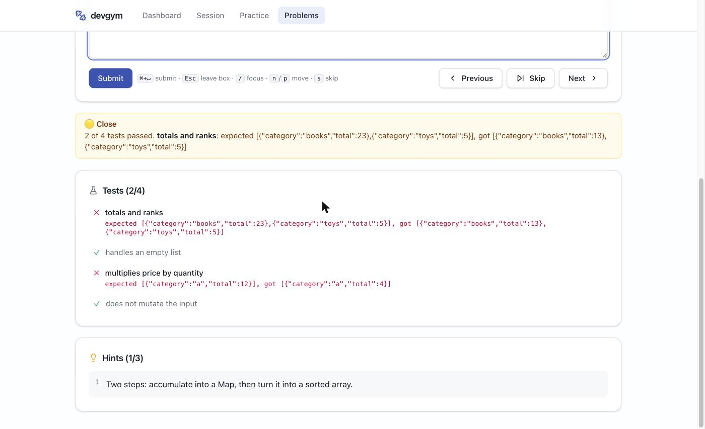

# devgym

A local-first practice gym for staying sharp on web-dev fundamentals: SQL, JavaScript, TypeScript,
React, HTTP and the DOM. Two modes. **Problems** are short reps: type an answer, get tiered
feedback (correct / close / not close), come back to it on a spaced-repetition schedule.
**Workouts** are 20-minute builds against a real toolchain: read a brief, edit real files, run
checkpoints, see how far you got. You write every answer yourself and a deterministic grader marks
it, so the reps stay yours. No AI in the loop, fully offline, single user, no accounts.

**Status:** built and in daily use. 229 problems across 15 categories, and 8 workouts spanning
Express, NestJS, Drizzle, Kysely, TypeORM and React. Deterministic grading, executable code
problems, spaced repetition, pinned daily sessions.
[PRD-v2.md](./PRD-v2.md) is the live spec; [PRD.md](./PRD.md) is the original v1 one, kept for
provenance. Code execution and spaced repetition were v1 non-goals and were pulled forward
deliberately.

## Quickstart

```sh
pnpm install
pnpm dev        # server on :3001, web on :5173; DB auto-migrates and auto-seeds
```

Open http://localhost:5173 and hit **Start a session**. Requires Node 20+. Nothing else: no API
keys, no accounts, no network calls at runtime.



```sh
pnpm verify     # the gate: typecheck, lint, format and the full test suite, in parallel
pnpm test       # 417 unit tests: graders, seed data, workout content, queue, sessions, scheduling
pnpm build      # typecheck and build every package
pnpm seed       # rebuild practice.db and upsert problems by slug
pnpm grade      # check a grader from the terminal (see below)
```

`pnpm verify` formats and lint-fixes your changed files before it checks them, so most of what it
would complain about is gone by the time it reports. It runs on pre-push; `SKIP_VERIFY=1 git push`
skips it. Commits run `lint-staged` instead, which only touches staged files.

`pnpm dev` only auto-seeds an **empty** database. After adding or editing problems, run `pnpm seed`
to upsert them into an existing one.

## The daily loop

`/session` pins a fixed set of problems (5, 10 or 20) so the list cannot shift underneath you.
Every problem page then shows `Problem 3 of 10` with a progress bar, Next and Skip stay inside the
session, and finishing gives you a summary with solved / skipped counts and elapsed time.

Due reviews come first, then new material. Solved problems leave the queue, so tomorrow picks up
where today stopped. Only one session runs at a time; starting a new one closes the old.

- **Spaced repetition.** Solving schedules the problem to come round again after 1 day, then 3, 7,
  21 and 60 as you keep getting it right. Failing a review drops it back to the first rung. Solved
  is sticky, so a failed review never unsolves anything. `/practice?mode=due` serves what is due.
- **Review queue.** `/practice?mode=review` serves everything you attempted **or skipped** and have
  not yet solved. The dashboard links to it whenever there is something waiting.
- **Focused practice.** `/practice?category=react&difficulty=hard` drills one slice without pinning
  anything, running until the queue empties. The scope lives in the URL, so it survives a refresh
  and follows you through Next / Previous / Skip. Start one from the dashboard, or from the problem
  list with **Practice these**.
- **Keyboard.** `/` focuses the answer box, `Cmd/Ctrl+Enter` submits, `n` / `p` move, `s` skips,
  `Esc` leaves the box. The answer box takes focus on load, so press `Esc` before using the
  single-key shortcuts.
- **Starting over.** The dashboard reset clears statuses only, or clears everything (attempts,
  schedules and sessions) and returns to the zero state.

## Problem library

| Category           | Problems | Covers                                                                                       |
| ------------------ | -------: | -------------------------------------------------------------------------------------------- |
| SQL                |       29 | joins, aggregates, `HAVING`, anti-joins, self-joins, CTEs, window functions, recursive trees |
| React              |       22 | state updates, effects and cleanup, keys, stale closures, memoisation, transitions           |
| TypeScript         |       22 | utility types, narrowing, generics, discriminated unions, `satisfies`, exhaustiveness        |
| JS APIs            |       20 | array/object methods, promises, the event loop, closures, cloning, `AbortController`         |
| Coding             |       20 | **write the function**: chunk, debounce, memoize, LRU, retry, concurrency pool, deep equal   |
| HTTP & Fetch       |       22 | status codes, `response.ok`, CORS preflight, caching, ETags, SSE, the WebSocket handshake    |
| Debugging          |       15 | spot-the-bug snippets: async `forEach`, `this`, floats, shared references                    |
| CSS & Layout       |       12 | box sizing, specificity, flex and grid, margin collapse, stacking and container queries      |
| Accessibility      |       12 | accessible names, heading order, focus management, live regions, reduced motion              |
| Query Params       |       10 | `URL` / `URLSearchParams`, encoding, relative resolution                                     |
| Forms & Validation |       10 | submit handling, `FormData`, validating on both sides, double submits                        |
| Dates & Time       |       10 | UTC storage, locale formatting, DST, durations, timer drift                                  |
| DOM & Browser      |        9 | delegation, `textContent` vs `innerHTML`, storage, observers                                 |
| Testing            |        8 | query priority, what to mock, testing behaviour over implementation, flaky timing            |
| Auth & Security    |        8 | XSS sources, injection, token storage, password hashing, open redirects                      |

74 easy / 117 medium / 38 hard. The queue runs easy → medium → hard and round-robins across
categories, so you never get twenty SQL questions in a row.

## How grading works

All grading is deterministic and local. No LLM, no network.

- **SQL** (29) runs your query against `practice.db` opened **read-only**, then compares raw row
  values against the canonical solution executed at the same moment. Column names and aliases never
  matter; row counts, values and (where stated) order do. Non-read statements are refused, as is
  `ATTACH`, so `app.db` is unreachable from user SQL.
- **Coding** (23) runs your function against real assertions and reports per-test pass/fail with
  expected vs actual. Console output from a failing test is attached to the diff. The editor
  prefills the signature so your function name matches the tests.
- **Short-text** (96) normalises both sides (case, whitespace, quotes, code fences, trailing
  punctuation), then checks exact matches, regex patterns, known near-misses, and finally fuzzy
  matching for typos.
- **Explain** (81) scores keyword groups: every idea must appear, half of them earns a "close".

Every non-correct attempt reveals the next hint. After three attempts you can reveal the solution,
which marks the problem skipped rather than solved.

### Running your code

Coding problems execute in a `node:vm` context with a 1 second timeout and no `require`, `process`
or filesystem access. **That is an isolation convenience, not a security boundary.** Determined code
can reach the host realm through constructor chains. It is fine here because devgym runs locally and
executes only code you typed yourself, which is the same trust level as `pnpm dev`. Do not reuse
`grading/code-runner.ts` to run code from anyone else.

### Tuning a grader

Answers are matched by pattern, so a grader can be too strict. Check one directly:

```sh
pnpm grade js-find "find"                # verdict + the exact config it was measured against
pnpm grade code-chunk "function chunk…"  # prints per-test results
pnpm grade sql-anti-join "SELECT …"      # SQL runs against the seeded practice.db
pnpm grade js-find                       # show the prompt and the model answer
pnpm grade --list react                  # slugs in a category
```

## Workouts

A workout is 20-25 minutes against a real toolchain. `/workouts` lists them; opening one gives you
a brief written like a ticket, the project's files in an editor, and a timer. **Run** materialises
your files into a workspace on disk and runs the checkpoint suites against them.

A checkpoint is one test file, and it passes only when every assertion in it does. That is what
makes an unfinished attempt worth something: at ten minutes you can see two of four green, and the
failure output tells you which behaviour is missing. Each checkpoint carries a hint that appears
after it fails. The reference solution is there when you want it.

| Workout                                   | Stack                  | Min | Shape    |
| ----------------------------------------- | ---------------------- | --: | -------- |
| Sortable employee table, end to end       | Drizzle, SQLite, React |  20 | feature  |
| Login and a protected route               | Express, jose          |  20 | feature  |
| The orders list got slow                  | Kysely, PGlite         |  25 | bug-hunt |
| Search the product catalogue              | Drizzle, PGlite        |  20 | feature  |
| Rate limit an endpoint with Redis         | Express, fake Redis    |  20 | feature  |
| Autocomplete that behaves itself          | React, fixture API     |  25 | feature  |
| The orders report melts under real data   | TypeORM, SQLite        |  25 | bug-hunt |
| The ownership check is in the wrong place | NestJS                 |  20 | bug-hunt |

Nothing reaches the network. Postgres is [PGlite](https://pglite.dev), which is Postgres compiled
to WASM and running in-process, so `ILIKE` and `EXPLAIN` are the real thing. Redis is a small fake
with the real `ioredis` surface plus a clock you can wind forward, which is how a checkpoint waits
out a sixty-second window for free.

### Adding a workout

A workout is a directory under `packages/workouts/content/<slug>/`, and adding one touches no
application code:

```
workout.json                 manifest: stack, minutes, checkpoints, which files you edit
brief.md                     the task
files/                       the starting project
tests/checkpoints/*.test.ts  one suite per checkpoint, hidden from the editor
solution/                    the reference implementation
```

Needs a library the others don't use? Add it to `packages/workouts/package.json`. Each workspace
symlinks its `node_modules` there, so a workout imports the real drizzle-orm with no install per
attempt. `workouts.spec.ts` then holds the content to the same bar as the problems: every solution
passes every checkpoint, and every starter fails at least one.

## Layout

- `apps/web`: Vite + React + shadcn/ui frontend
- `apps/server`: NestJS + Drizzle + SQLite
- `packages/shared`: shared TypeScript types, dual CJS/ESM so both apps resolve named exports
- `packages/workouts`: workout content, the scaffold copied into each workspace, and the dependency
  set every workspace resolves against
- `apps/server/src/grading`: the four graders plus the sandboxed code runner
- `apps/server/src/seed/problems`: one file per category, positions generated at seed time
- `apps/server/src/workouts`: workspace materialisation and the vitest checkpoint runner
- `PRD-v2.md`: the live spec · `PRD.md`: the v1 one, kept for provenance · `CLAUDE.md`: context for
  coding agents · `WRITING.md`: how everything a user reads is written

### Data

Two SQLite files in `apps/server/data/` (gitignored, created on boot):

- `app.db`: problems, attempts, progress, sessions, workout attempts. Six committed migrations,
  applied at startup.
- `practice.db`: the read-only dataset SQL problems query. A small bookstore: `authors`, `books`,
  `customers`, `orders`, `order_items`, `reviews`, `inventory`, and a self-referencing `employees`
  table for hierarchy questions. Rebuilt from scratch by the seeder.

`data/workouts/<attemptId>/` holds the workspace for a workout you have open, and is deleted when
the attempt finishes. Delete `apps/server/data/` to start completely over.

## Adding problems

Problems live in `apps/server/src/seed/problems/<category>.ts` and are upserted by slug, so editing
one updates it without wiping your attempt history. `position` is generated, not authored.

The test suite enforces the things that are easy to get wrong: every canonical answer must grade
`correct`, every declared near-miss must grade `close`, every `acceptPattern` must compile, no
keyword synonym may normalise to an empty string, and every coding problem's reference
implementation must pass its own tests while its starter must not.

## About and credits

Two things worth saying plainly, and there is a fuller version at `/about` in the app.

**This content was largely written by an LLM, and is reviewed progressively as it gets used.** A page
gets read properly during the study session it was written for, and corrected there. The test suite
guarantees that every canonical answer grades correctly and every workout solution passes its
checkpoints; it cannot guarantee that an explanation or a handbook page is true. Every handbook page
carries its sources and the date its claims were last checked against them, so you can see how far
that review has actually got. Corrections are welcome and easy to make; every piece of content is a
small file in this repo.

**It owes nearly everything to other people.** Open source software, freely shared writing, and the
people who teach: course authors, documentation writers, bloggers, and the maintainers of every
library in the lockfile. Handbook pages cite their sources in a footnote, and `pnpm verify` refuses
a page that cites nothing or cites through a link shortener. If something should be credited and
isn't, that's a bug worth an issue.

## Contributing

Issues and pull requests are both welcome. The bar is `pnpm verify` passing, which is one command
and the same thing CI runs. Content is the most useful contribution and the easiest to review: add
a problem to `apps/server/src/seed/problems/` and run `pnpm seed`, or add a workout directory under
`packages/workouts/content/`. Either way the test suite tells you whether it is well-formed. Read
[WRITING.md](./WRITING.md) first, since it governs everything a user reads. If a grader marked a
correct answer wrong, paste the output of
`pnpm grade <slug> "<answer>"` into an issue and that's usually the whole diagnosis. See
[CONTRIBUTING.md](.github/CONTRIBUTING.md).

## Licence

[MIT](./LICENSE). Fork it, take the graders, take the problems, build your own gym.
